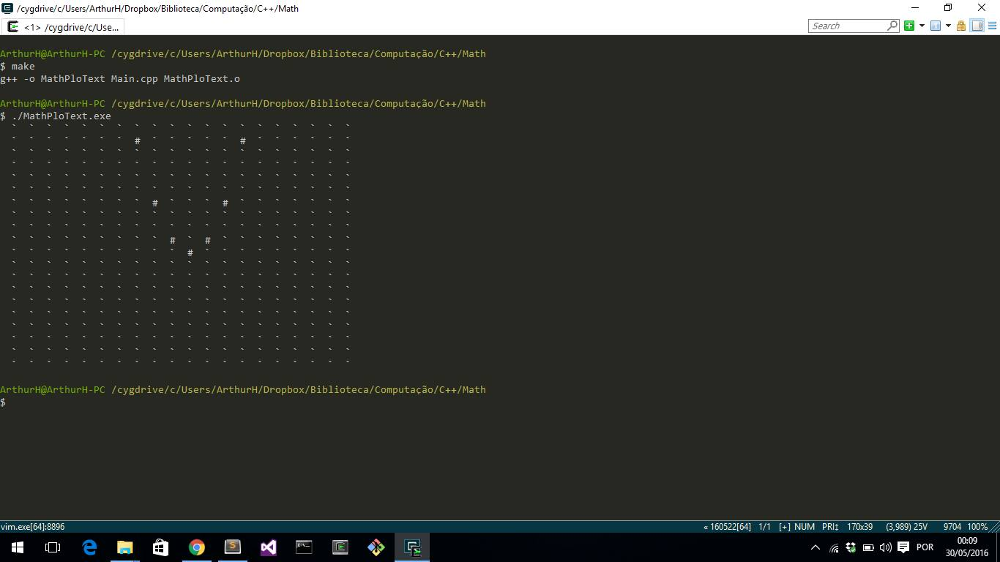

MathPloText
=======

Cartesian plan plotted with ASCII

TODO List
---------

Implement severals Math functions, as derivative, integral from a defined function.

Call a defined function by address in a parameter of generic function.

Implement anothers lines of function at the same time, using mutex concept.

Implement a interpreted language to write a function in CLI mode and plot.
